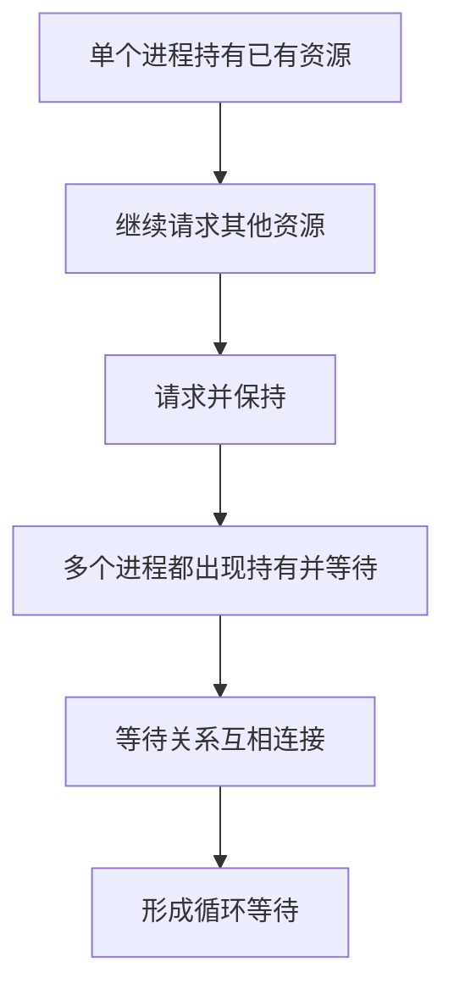

# 从死锁四大必要条件看操作系统概念的形成逻辑

## 1. 问题来源

在学习操作系统死锁问题时，我最初接触到的是死锁的四个必要条件：

- 互斥条件；
- 请求并保持条件；
- 不剥夺条件；
- 循环等待条件。

刚开始学习时，我也只是把它们当作需要记忆的知识点。但在进一步理解过程中，我发现其中的“请求并保持”和“循环等待”在概念上存在一定相似性。

“请求并保持”描述的是：一个进程已经持有某些资源，同时继续请求新的资源，并且在等待过程中不释放已经持有的资源。

“循环等待”描述的是：多个进程之间形成首尾相接的等待关系，每个进程都在等待下一个进程所持有的资源。

从表面上看，二者都与“持有资源并等待其他资源”有关。因此，我产生了一个疑问：既然二者在逻辑上存在相似之处，为什么它们会同时出现在死锁的四个必要条件中？

这个疑问也让我最开始对这两个概念区分得并不清楚。背的时候能背出来，但真让我解释它们为什么不同，我其实说不太明白。

例如：

```text
P1 持有 R1，等待 R2；
P2 持有 R2，等待 R1。
```

从条件角度看，它既能说 P1、P2 都满足“请求并保持”，又能说 P1 和 P2 之间形成了“循环等待”。

这样一来，我就更觉得这两个条件之间的边界有点模糊。

## 2. 从死锁预防方法中产生的新疑问

在学习死锁预防方法时，我进一步发现，破坏“请求并保持”和破坏“循环等待”的方法在效果上也存在一定重叠。

破坏“请求并保持”的常见方式是：要求进程一次性申请全部所需资源，或者在申请新的资源之前释放已经持有的资源。

这种做法的目的，是避免进程出现这种状态：

```text
已经持有一部分资源，同时又继续等待其他资源。
```

也就是避免“边占有，边等待”。

破坏“循环等待”的常见方式是：对系统资源进行统一编号，规定进程必须按照固定顺序申请资源，从而避免形成环形等待链。

例如系统中有 R1、R2、R3 三类资源，规定进程只能按照编号递增的顺序申请：

```text
可以先申请 R1，再申请 R2；
不能先申请 R3，再回头申请 R1。
```

这两种方法的具体实现不同，但最终目的都与阻止进程之间形成相互等待有关。

这让我意识到，“请求并保持”和“循环等待”并不是完全割裂的两个概念。它们可能描述的是同一类死锁形成逻辑，只是观察角度不同。

## 3. 我的理解：逻辑重叠与视角差异

经过进一步查阅资料和思考后，我对这两个条件的理解是：

> “请求并保持”更偏向个体进程视角，关注单个进程在资源申请过程中的行为；
>
> “循环等待”更偏向系统整体视角，关注多个进程之间是否形成了闭环等待结构。

也就是说，“请求并保持”描述的是局部行为，而“循环等待”描述的是整体结构。

从单个进程来看，一个进程可能持有资源，同时又请求新的资源，这就是“请求并保持”。

从整个系统来看，多个进程都处于类似的“持有并等待”状态，并且这些等待关系首尾相接，就形成了“循环等待”。

因此，我认为二者并不是简单重复，而是同一类问题在不同层次下的表现。

## 4. 用图理解二者关系

可以将二者关系理解为：



从这个过程可以看出：

- “请求并保持”更像是死锁形成的局部行为基础；
- “循环等待”更像是局部行为在系统层面组合后的整体结构结果。

## 5. 一个典型死锁场景

假设系统中存在两个进程 P1、P2，以及两个资源 R1、R2。

- P1 已经持有 R1，同时请求 R2；
- P2 已经持有 R2，同时请求 R1；
- P1 等待 P2 释放 R2；
- P2 等待 P1 释放 R1。

可以用图表示为：


在这个例子中，从个体角度看：

- P1 持有 R1，同时请求 R2；
- P2 持有 R2，同时请求 R1。

所以二者都满足“请求并保持”。

从整体角度看：

- P1 等待 P2；
- P2 又等待 P1。

系统中形成了一个闭环等待结构，所以满足“循环等待”。

这说明，同一个死锁场景可以从不同层次进行解释：个体层面看到的是请求并保持，系统层面看到的是循环等待。

## 6. 为什么破坏条件的方法会出现交叉

死锁四大必要条件同时成立时，死锁才可能发生。因此，破坏任意一个必要条件，都可以达到预防死锁的目的。

从形式上可以理解为：

$$
Deadlock \Rightarrow C_1 \land C_2 \land C_3 \land C_4
$$

其中：

- $C_1$ 表示互斥条件；
- $C_2$ 表示请求并保持；
- $C_3$ 表示不剥夺条件；
- $C_4$ 表示循环等待。

预防死锁的基本思路就是破坏其中任意一个条件：

$$
\neg C_1 \lor \neg C_2 \lor \neg C_3 \lor \neg C_4
$$

破坏“请求并保持”时，是从局部行为上阻止进程在持有资源的同时继续等待新资源。

破坏“循环等待”时，是从全局结构上阻止多个进程的等待关系形成闭环。

二者不是完全等价，但在预防死锁的效果上确实存在交叉。

可以这样理解：

> 破坏“请求并保持”，是在源头上减少形成等待链的可能；
>
> 破坏“循环等待”，是在系统层面限制等待链形成闭环。

这也解释了为什么二者的解决方法在目标上会出现一定交叉：它们都在阻断死锁形成过程中的等待关系，只是切入层次不同。

## 7. 从历史来源看四大必要条件

死锁四大必要条件通常被称为 Coffman Conditions，通常追溯到 Coffman、Elphick 和 Shoshani 在 1971 年发表的论文 *System Deadlocks*。

在此之前，Havender 也在 1968 年的 *Avoiding Deadlock in Multitasking Systems* 中讨论过多任务系统中避免死锁的问题。

这说明死锁四大必要条件并不是为了考试而生硬拆分出来的概念，而是早期操作系统在处理多任务并发、资源竞争和资源分配问题时逐渐抽象出来的。

因此，“请求并保持”和“循环等待”之间存在一定逻辑重合，并不奇怪。它们本来就是围绕资源占有、资源等待和进程关系展开的，只是一个更偏向单个进程行为，一个更偏向系统整体结构。

## 8. 从逻辑角度与工程角度理解

从逻辑角度看，“请求并保持”和“循环等待”之间存在一定重合。

因为循环等待的形成，往往依赖多个进程都处于“持有资源并等待其他资源”的状态。也就是说，多个局部的“请求并保持”行为组合到一起，就可能形成系统层面的“循环等待”。

但从工程角度看，二者又有不同价值。

“请求并保持”更适合从进程行为约束的角度进行分析。例如，系统可以要求进程一次性申请资源，或者在申请新资源前释放已有资源。

“循环等待”更适合从资源分配策略的角度进行分析。例如，系统可以为资源编号，并要求进程按照统一顺序申请资源，从而避免等待关系成环。

因此，二者虽然在逻辑上存在重叠，但在工程实践中分别对应不同的分析视角和设计方法。

## 9. 启发

这次学习经历让我意识到，408 中的知识点并不是孤立出现的，也不只是为了考试而被机械列出。

很多概念来自真实问题，又在不断分析、抽象和补全中形成教材中的定义。

死锁四大必要条件并不是简单的四条结论，而是从资源互斥、进程行为、资源剥夺方式、系统等待结构等多个角度对死锁形成原因进行描述。

如果只是背定义，我可能会一直觉得“请求并保持”和“循环等待”很像；但如果继续追问它们为什么会被分开、为什么预防方法会出现交叉，就能发现它们背后其实对应着不同的分析角度。

对我来说，学习 408 不只是记忆知识点，而是通过这些知识点理解计算机系统背后的设计逻辑。

这也是我将这类思考整理到 GitHub 的原因：通过技术文档的方式，把学习过程中的问题、推导、图示和总结沉淀下来，逐步形成自己的计算机基础知识体系。

## 参考资料

- Coffman, E. G., Jr., Elphick, M. J., & Shoshani, A. (1971). *System Deadlocks*. ACM Computing Surveys, 3(2), 67–78. https://doi.org/10.1145/356586.356588
- Havender, J. W. (1968). *Avoiding Deadlock in Multitasking Systems*. IBM Systems Journal, 7(2), 74–84.